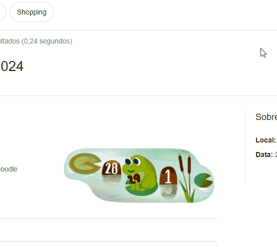

# Projeto com README
Um projeto de teste com um arquivo README✨

[]

## Tecnologias Utilizadas
- HTML
- CSS

## Como Utilizar

1- Clone o projeto
```
git clone <https://github.com/MCosta69/repositorio-com-readme.git>
```

2- Acesse a pasta do projeto
```
cd repositorio-com-readme
```